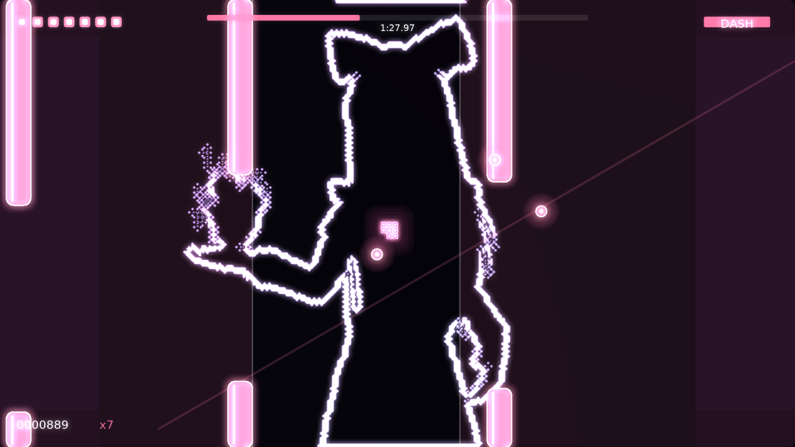
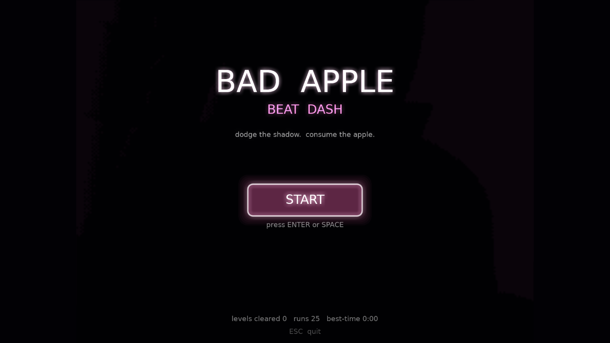

# Bad Apple // Beat Dash

A bullet-hell dodge game played on top of the original Bad Apple shadow-art video. Built in LÖVE2D 11.5 for [games.brassey.io](https://games.brassey.io).

The silhouette is real terrain — its edge is rendered as a bright, always-visible accent outline so the danger zone is unambiguous. Brushing through is fine; *lingering* inside it for ~0.85 s deals damage. Bullets, beams, waves, rings, spinners and chasers spawn on real beat / kick / snare / hat events extracted from the audio, with their warn windows resolving **on** the beat.



The flow:

```
START  →  LOBBY (hub)
              │
              │  customise your square in-place while peers walk around you
              │
              ▼
       glowing GATE  →  level (the song)  →  back to LOBBY (with new unlocks)
```



## Run

```sh
love .
```

Targets LÖVE 11.5 / Lua 5.1.

## Controls

| Key | Where | Action |
| --- | --- | --- |
| **ENTER** / **SPACE** | menu | START — drop into the lobby |
| **WASD** / **arrows** | lobby, play | move |
| **SPACE** / **SHIFT** | lobby, play | dash (i-frames + buffered while on cooldown) |
| **Q** / **E** | lobby | cycle colour (skips locked) |
| **Z** / **X** | lobby | cycle aura (skips locked) |
| walk into **GATE** | lobby | begin the song |
| **R** / **ENTER** | dying, dead | revive / retry |
| **N** | dead | new run from start |
| **P** / **ESC** | play | pause |
| **Q** | paused | back to menu |
| **ESC** | most | up one level |

## State machine

```
boot → loading → menu → lobby → play → (paused | dying → reviving → play | dead | win) → lobby
```

The lobby is the central hub — the four HUD panels show your handle, customisations, and profile while the centre of the screen is a roam-able play space. Walking into the glowing gate on the right transitions to the level. Win or quit drops you back into the lobby.

## Lobby (the hub)

A sophisticated chrome surrounds a central play box where you walk around as your square. Other connected players appear in the same play box — their colour, halo width, dash trail and authenticated handle render exactly as theirs do. The HUD has four panels:

- **Top bar** — handle, BAD APPLE banner, completion ring (out of 8), connected peer count, sign-in status.
- **Left** — *APPEARANCE*: 12-colour swatch grid (locked entries show a padlock icon), aura list (4 entries with their unlock thresholds inline).
- **Right** — *PROFILE*: levels cleared, runs, deaths, hits taken, best time, latest unlock, level intro copy.
- **Bottom** — control hints.

The glowing gate on the right edge of the play box is the only entry into the level: walk into it. Position broadcasts at 4 Hz over `[[LOVEWEB_NET]]send pos {x,y,hp,d,c,u}`.

## Pipeline

1. Source video downloaded to `badapple_src.mp4` (gitignored, ~7 MB).
2. `ffmpeg` extracts the soundtrack to `assets/badapple.ogg` (libvorbis q=5).
3. `ffmpeg` packs frames into 103 monochrome 1-bit spritesheets at 240×180 packed 8×8 (`assets/sheets/sheet_NNN.png`).
4. `ffmpeg` writes a separate 80×60 1-bit silhouette stream to `assets/collision.bin` — used by the **silhouette hover hazard** to know whether the player is currently inside the shadow.
5. `tools/analyze_audio.py` decodes the OGG, runs band-split spectral-flux onset detection, estimates BPM by autocorrelation, and writes 4 362 events to `assets/beats.txt`.

Total runtime asset size: ~17 MB. Sheets are streamed lazily at runtime (4-entry LRU cache), so peak GPU RAM stays bounded.

## Architecture

```
bad-apple/
  conf.lua                       window 1920×1080, identity = bad_apple
  main.lua                       state machine, dispatcher, FX, achievements
  achievements.json              15-entry catalogue
  README.md, LICENSE, .gitignore
  assets/
    badapple.ogg                 extracted soundtrack
    beats.txt                    # bpm + (type, time, strength) events
    collision.bin                6572 frames × 80×60 1-bit silhouette mask
    sheets/sheet_001..103.png    monochrome spritesheets, 8×8 frames each
    screenshots/                 README art (gameplay.png, menu.png)
  src/
    video.lua                    lazy spritesheet cache + LRU eviction
    collision.lua                1-bit mask sampler + box-hit helper
    beats.lua                    cursor-based pre-roll event firer (+ proximity)
    player.lua                   3×3 fragment body, sparkle trail, dash buffer
    obstacles.lua                bullet / burst / beam / wave / ring / spinner / chaser
    director.lua                 song-aligned intensity ramp + deterministic gate
    glow.lua                     two-pass separable Gaussian bloom
    mosaic.lua                   silhouette colorizer with 4-tap edge outline
    save.lua                     atomic save (tmp + swap)
    multiplayer.lua              [[LOVEWEB_NET]] ghost positions / colour / dashes
    lobby.lua                    HUD panels, grid floor, glowing gate
    sfx.lua                      synthesised dash / hit / tick / revive / death
  lib/json.lua                   rxi/json.lua (MIT)
  tools/analyze_audio.py         band-split onset + BPM autocorrelation
```

## Silhouette as terrain

`src/mosaic.lua` colours the silhouette video each frame:

- backdrop and silhouette body are both rendered very dark — the silhouette body is *darker* than the backdrop so the player and obstacles always pop.
- a 4-tap luminance gradient inside the shader detects the silhouette boundary and lights it with the current accent palette colour. The outline is always visible — you always know exactly where the danger ends.
- a per-run hue offset rotates the palette through pink / cyan / violet / amber so each play looks slightly different.

The hazard itself is a **stay timer**, not a collision flag:

- if the player's hit-circle overlaps a bright silhouette pixel, `sil_stay_t` accumulates `dt`.
- if it doesn't, `sil_stay_t` decays at 3× speed.
- crossing the threshold (0.85 s of cumulative stay) calls `player:hit()` and resets the timer.
- a red pulsing ring around the player and a HOVER meter under the hearts ramp up as the timer climbs, so you always have a fair warning before the hit lands.

Brush through the silhouette and you're fine. Stand inside it and the song punishes you.

## Player

- 3×3 grid of small rounded fragments + a bright central core. Each hit detaches one fragment (favouring the side opposite your input direction) and fires it off as a chunky shard plus a few smaller dust pieces.
- Sparkle trail of small glowing rounded squares spawns behind the player when moving; dashing triples the spawn rate.
- Tight fixed hit-circle around the centre core — only direct contact with an obstacle's coloured hot zone (or extended silhouette stay) hurts.
- Dash buffer queues a press during cooldown. `DASH_COOLDOWN 0.52` exceeds `IFRAME_DASH 0.40` with margin so dash spam can't grant permanent invulnerability.
- Hit-flash, knockback, screen shake, 60 ms hit-stop on damage, red screen-edge tint on damage / cyan tint on close-call dodge.

## Obstacles

Every obstacle uses the same three-layer language so it reads at a glance:

1. soft outer glow halos (large, low alpha) — decorative, never hurt
2. bright pulsing white border ring — the visible danger edge (throbs at ~7-8 Hz, tied to `audio_t`)
3. filled rounded core in the accent colour — the actual hit zone

| Type | Shape | Telegraph | Hot |
| --- | --- | --- | --- |
| Bullet | rounded disc | accent guideline + expanding outline ring | 0.50 s |
| Burst | radial bullet ring | shared bullet preview | 0.50 s |
| Beam | rounded capsule | thin pulsing line + growing capsule preview | 0.55 s warn / 0.30 s fire |
| Wave | rounded slab pair with a gap | semi-transparent halves + pulsing white gap edges | 0.70 s |
| Ring | accent band, bright inner + outer borders | strobing accent outline growing radially | 0.50 s |
| Spinner | capped capsule arms with white core | strobing preview lines + centre marker | 0.65 s |
| Chaser | rounded orb that homes on the player | pulsing accent ring at spawn point | 0.60 s |

## Director

`Director.intensity(audio_t)` shapes the spawn density across the song:

```
intro (0-13)  verse 1 (13-46)  chorus 1 (46-78)  verse 2 (78-111)
chorus 2 (111-144)  bridge (144-177, cools off)  final chorus (177-210)  outro
```

The first 6 s lifts the floor to 0.05 so the player always sees one bullet early. Climax peaks at 0.40. `spawnGate(type, intensity, base)` is **deterministic** — accept every Nth event of a type at a rate scaled by intensity. No random coin-flip swings.

## Beat sync

`src/beats.lua` pre-rolls events 0.50 s ahead of the playhead so each obstacle's *fire* moment lands on the beat rather than starting on the beat. Soft revives rewind audio by 0.6 s — greater than the longest warn — so events that already fired pre-death aren't re-fired on resume.

## Saves

`save.json` (atomic write: tmp file + swap, cloud-synced via `love.filesystem`) tracks:

- `player_color`, `aura_id` — selected cosmetics
- `completions` — number of song clears (drives unlocks)
- `last_unlock` — string surfaced on the win screen and the lobby right panel
- `last_checkpoint`, `best_time`, `runs`, `deaths`, `hits_taken`, `dashes`
- `volume`, `completed`

Missing keys are filled with sensible defaults at boot, so older saves keep working when new fields land.

## Unlocks (per song completion)

Customisations unlock by clearing the level — there is no currency.

| Completions | Unlock |
| --- | --- |
| 1 | colour: lime |
| 2 | colour: ember + aura: Spinning Ring |
| 3 | colour: sky |
| 4 | colour: ivory + aura: Twin Echoes |
| 5 | colour: void |
| 6 | colour: blood + aura: Starlit Halo |
| 7 | colour: phantom |
| 8 | colour: gold |

Locked palette swatches show a padlock icon and the number of wins remaining; the win screen and lobby announce each new unlock as it lands.

## Achievements

15 entries in `achievements.json`, fired through `[[LOVEWEB_ACH]]unlock <key>`:

| Key | Title |
| --- | --- |
| first_blood | Tasted the Apple |
| first_dash | Quickstep |
| intro_clear | Past the Hush |
| halfway | Through the Mirror |
| chorus_survivor | Beneath the Chorus |
| apple_complete | Apple Consumed |
| untouched | Untouched |
| pacifist | Pacifist Runner |
| dasher | Dash Hand |
| close_call | Close Call |
| unbroken | Unbroken Combo |
| second_chance | It's NOT Over |
| flawless_intro | Clean Open |
| lobby_visitor | Not Alone |
| loop_lover | Loop Lover |

## Portal FX

Magic-print verbs emitted via `[[LOVEWEB_FX]]`:

- `flash <hex> <ms>` on hit / revive / win / gate entry
- `shake <intensity> <ms>` on hit / death / heavy kicks
- `mood <hex> <0..1>` drifts at ~3 Hz with the song accent (even in the lobby)
- `ripple <hex> <x01> <y01> <ms>` on dash + revive + gate entry
- `shatter <intensity> <ms>` on death + revive transitions

## Death / revive

Dying plays "IT'S OVER" for 1.6 s with the body shattering, music ducked to 20 % volume, then auto-transitions through a chromatic-glitch shader to "IT'S NOT OVER" for 1.4 s, restores volume, replays the death stinger as a revive swell, and resumes the song from `death_audio_t − 0.6 s` with full HP and brief invulnerability. **R** / **ENTER** during *dying* skips straight to the revive.

## Debug knobs

```
BADAPPLE_AUTORUN=<seconds>            skip the menu and start at this song time
BADAPPLE_QUIT_AT=<wall_seconds>       quit after this many seconds (smoke tests)
BADAPPLE_SCREENSHOT_AT=<wall_seconds> capture a frame and save to BADAPPLE_SCREENSHOT_PATH
BADAPPLE_SCREENSHOT_PATH=<filename>   default 'screenshot.png' (lands in love save dir)
```

## License

MIT. The Bad Apple shadow-art video and audio are not redistributed in this repository — the build pipeline downloads the source and extracts assets locally.
